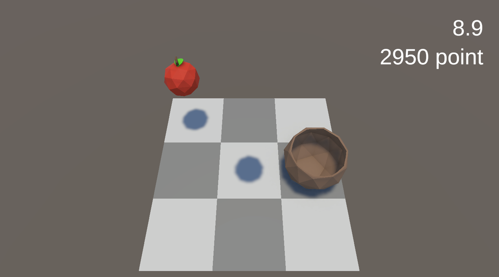

# Research-CatchFruit

## Preview

---

## Introduction

> Unity 엔진을 사용하여 간단한 과일 먹기 게임을 구현해 보자.  
> 터치/마우스 입력을 이용해 바구니를 움직이며, 떨어지는 과일을 잡는 미니게임.  
> 사과와 바나나를 먹으면 점수가 올라가고, 폭탄을 먹으면 점수가 줄어든다.  
> 사과는 기본점수, 바나나는 높은점수(5번 마다 등장).  

---

## 기술 및 학습 내용

| 구분 | 내용 |
|------|------|
| Prefab 생성 및 Instantiate() 활용 | 아이템(사과, 바나나, 폭탄)을 프리팹으로 관리하고 코드에서 동적 생성 |
| Input System으로 터치 입력 처리 | UnityEngine.InputSystem을 사용하여 터치 좌표를 읽어 바구니 이동 |
| Raycast로 터치 위치 인식 | 스크린 좌표를 월드 좌표로 변환하여 정확한 이동 구현 |
| AudioSource로 효과음 재생 | 아이템별 사운드를 PlayOneShot()으로 재생 |
| Tag로 아이템 구분 및 충돌 처리 | OnTriggerEnter()에서 태그별 이벤트 처리로 점수 계산 |
| GameManager로 게임 상태 관리 | 시간, 점수, 게임 종료 상태를 중앙에서 제어 |
| PlayerPrefs로 최고 점수 저장 | 로컬 저장소를 이용해 최고 점수를 저장 및 불러오기 |
| SceneManager로 씬 재시작 | SceneManager.LoadScene()으로 게임 재시작 구현 |
| TextMeshPro로 UI 갱신 | 점수와 타이머를 실시간으로 업데이트 |
| itemGenerator로 난이도 조절 | 남은 시간에 따라 스폰 속도 및 확률 조정 |
| Random.Range()로 아이템 스폰 | 랜덤 좌표와 아이템 타입을 사용한 다양한 생성 로직 |
| GameObject.Find() & GetComponent() | 다른 오브젝트 및 컴포넌트에 접근하여 통신 처리 |

---

## 개선 아이디어

- 아이템 효과 확장 (점수 배수, 속도 변화 등, 먹는 아이템 마다 각기 다른 이펙트)

---

## Requirements

> 프로젝트 실행 환경 및 버전 정보

| 항목 | 내용 |
|------|------|
| OS | Windows 11 |
| Engine | Unity 6000.0.56f1 |
| Language | C# |

---

## Summary

이 프로젝트를 통해 Unity의 입력 시스템, 오브젝트 관리, UI, 오디오, 게임 루프 설계 등을 종합적으로 학습하였다.  
작은 규모의 게임이지만 Prefab 관리부터 GameManager 구조화까지, 실제 게임 개발의 핵심 흐름을 경험할 수 있었다.
